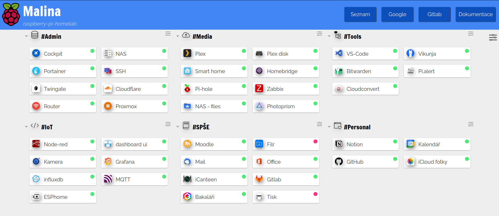

# Postup nastavení maliny


<br>

## Jaké RaspberryPI koupit?
- pro naše účely jsem zvolili verzy RaspberryPI 4 s 8gb RAM a 32gb disk
- vzhledem k tomu, že chceme na naší malině mít hodně užitečných věcí, tak verze s 8gb RAM bude potřeba
- <a href="https://rpishop.cz/RaspberryPI-4/2611-RaspberryPI-4-model-b-8gb-ram.html">Raspberry Pi 4 Model B - 8GB RAM</a>

<br>

## Operační systém
- při vybírání OS pro naše raspberry pi silně doporučuji si vybrat OS bez gui
- Vzhledem k tomu že GUI na RaspberryPI nepotřebujeme, tak stačí pro správu pouze příkazová řádka
- V našem případě použijeme: <a href="https://downloads.raspberrypi.com/raspios_lite_arm64/images/raspios_lite_arm64-2023-12-11/2023-12-11-raspios-bookworm-arm64-lite.img.xz"> Raspberry Pi OS Lite 64bit </a>
- nejlepší způsob instalace je přes <a href="https://www.raspberrypi.com/software/"> Raspberry Pi Imager </a>
- isntalace tohoto softwaru je velice jednoduchá:
```
sudo apt install rpi-imager
```
- jestli chceme nainstalovat imager na windows použijeme odkaz: <a href="https://downloads.raspberrypi.org/imager/imager_latest.exe"> Download for Windows </a>
- když otevřeme software, tak si vybereme OS, který chceme nainstalovat a poté klikneme na ozubené kolečko kde nastavíme ssh a hostname našeho raspberry na `raspberrypi.local`


- v našem případě jsme zvolili uživatele pi pro jednoduchost

<br>

## SSH
- naší malinu spravujeme zásadně přes SSH, které už máme nainstalované na našem RaspberryPI (port 22)
- pokud nevíme ip adresu našeho RaspberryPI, tak se přihlásíme pomocí hostanem, který jsem nastavili při instalaci v našem případě raspberrypi.local
```
ssh pi@raspberrypi.local
```
- pokud adresu chceme zjistit podíváme se na náš router který toto zařízení už rozpoznal po připojení maliny kabelem do sítě
- v našem případě: `192.168.1.202`

```
ssh pi@192.168.1.202
```

- po připojení uvidíme příkazou řádku


<br>

## Hned po instalaci

- jako první věc provedeme update všech balíčků a následně jejich upgrade

```
sudo apt-get update && sudo apt-get upgrade
```

<br>

## Instalace Dockeru


- Docker je open-source platforma pro kontejnerizaci, což je technologie, která umožňuje zabalení a spuštění aplikací a všech jejich závislostí v izolovaném prostředí nazývaném kontejner. Kontejnery jsou lehké, přenosné a obsahují vše, co je potřeba pro běh aplikace, včetně kódu, runtime, knihoven a dalších závislostí.
- Docker je nezbytnou součástí našeho projektu proto ho nainstalujeme jako jednu z prvních věcí
- instalace je jednoduchá pomocí jednoduchého commandu:

```
curl -sSL https://get.docker.com | sh
```
- úspěšnou instalaci si ověříme následovně:

```
docker --version
```

- po úspěšné instalaci uvidíme následovný výpis verze
- nakonec zde máme pář užitečných commandů, které nám mohou pomoc v budoucí práci s dockerem:


| Příkaz                            | vysvětlení                                            |
| --------------------------------- | ----------------------------------------------------- |
| `docker ps`                       | dává přehled o všech běžících kontejnerech            |
| `docker ps –a`                    | informuje o všech kontejnerech, i těch zastavených    |
| `docker start [container name]`   | spouští kontejner                                     |
| `docker stop [container name]`    | zastaví kontejner                                     |   
| `docker exec -it mycontainer sh`  | otevře daný mycontainer v příkazové řádce             |

<br>

## Portainer 

- Portainer je webové rozhraní pro docker a i přestože docker lze spravovat přes příkazovou řádku, tak mi z důvodu velkého počtu docker kontajnerů, které budeme instalovat si nainstalujeme webovou správu, která nám usnadní práci
- Instalace portaineru je jednoduchá a instaluje se jako docker kontejner dle následujících commandů
- Nejdříve pullneme image

```
sudo docker pull portainer/portainer-ce:latest
```

- poté nainstalujeme samotný kontejner

```
sudo docker run -d -p 9000:9000 --name=portainer --restart=always -v /var/run/docker.sock:/var/run/docker.sock -v portainer_data:/data portainer/portainer-ce:latest
```

- nyní ověříme jestli se nám povedlo portainer nainstalovat a jestli běží na portu 9000
- pomocí tohoto commandu si zobrazíme běžící kontejnery

```
docker ps
```

- nyní už stačí jen spustit náš oblíbený prohlížeč na zařízení v privátní síti a jít na adresu našeho RaspberryPI + číslo portu
- v našem případě to je adresa: <a href="http://192.168.1.202:9000"></a>
- zde si nastavíme heslo a můžeme se podívat na naše běžící kontejnery
- jeden z našich běžících kontejnerů je už nainstalovaný portainer
- postup je následovný: klikneme na **local** -> **Containers** a zde vidíme list běžících kontejnerů


<br>

## Cloudflare tunnel

- jednoduchosti je potřeba vytvořit tunel na našem RaspberryPI přes cloudflare zeto trust
- ze všeho nejdříve půjdeme na adresu cloudflare: https://www.cloudflare.com/
- poté můžeme pokračovat podle následujícího videa od @NetworkChuck: <a href="https://www.youtube.com/watch?v=ey4u7OUAF3c&t=315s"> odkaz </a>
- v rychlosti zde vytvoříme tunel, který bude na našem RaspberryPI přes zakoupenou doménu (doména může být i zdarma) díky tomu můžeme potom naše privátní adresy vystavit internetu např.: 

| Privátní adresa + port    | veřejná adresa                   |
| --------------------------| -------------------------------- | 
| http://192.168.1.202:9000 | https://portainer.nasedomena.com |

- o jakékoliv zabezpečení co se týče např. firewallu se postará samotný cloudflare
- zde je obrázek jak to celé funguje:


- instalaci tunelu na naší malinu provedeme stejně jako v přiloženém videu, tudíž přes docker

```
sudo docker run -d cloudflare/cloudflared:latest tunnel --no-autoupdate run --token "číslo našeho tokenu(každý token je jiný)"
```

- **po instalaci ještě nastavíme login v applications aby se na naší doménu nedostal nikdo jiný než vybraní uživatelé**
- login jde nastavit i přes jiné způsoby než jen e-mail, například my jsem nastavili github login
- návod zde ve videu: <a href="https://www.youtube.com/watch?v=wdmbAo02ktQ">Odkaz na video</a>


<br>

## Twingate


- Twingate je zero trust network access pomocí, kterého můžeme přistupovat do naší privátní sítě
- zde na obrázku můžeme vidět jak twingate funguje:


- pro jednoduchost použijeme opět video od @NetworkChuck: <a href="https://www.youtube.com/watch?v=IYmXPF3XUwo">Odkaz na video</a>
- twingate opět instalujeme do dockeru pomocí příkazu

```
docker run -d
 --sysctl net.ipv4.ping_group_range="youriprange"
--env TWINGATE_NETWORK="yournetwork" 
--env TWINGATE_ACCESS_TOKEN="youraccesstoken" 
--env TWINGATE_REFRESH_TOKEN="yourrefreshtoken"  
--env TWINGATE_LABEL_HOSTNAME="`hostname`" 
--name "yourname" 
--restart=unless-stopped 
--pull=always twingate/connector:1
```

- rovnou přidáme i druhý konektor

```
docker run -d
 --sysctl net.ipv4.ping_group_range="youriprange"
--env TWINGATE_NETWORK="yournetwork" 
--env TWINGATE_ACCESS_TOKEN="youraccesstoken" 
--env TWINGATE_REFRESH_TOKEN="yourrefreshtoken"  
--env TWINGATE_LABEL_HOSTNAME="`hostname`" 
--name "yourname" 
--restart=unless-stopped 
--pull=always twingate/connector:2
```

- po instalaci ověříme zda twingate běži jakožto docker kontejner

```
docker ps
```

- nyní už nám chybí jen nainstalovat twingate na **klienta**
- Ubuntu instalace:

```
curl -s https://binaries.twingate.com/client/linux/install.sh | sudo bash
```

- po instalaci twingate setupneme

```
sudo twingate setup
```

- setupu se koukneme na několik commandů, které budeme na linuxu používat

| Příkaz | Popisek |
| ----------------------- | --------------------------------------- |      
| `sudo twingate setup`   | konfigurace twingate                    |
| `twingate start` 	      | spustí twingate klienta                 |
| `twingate status` 	  | vypíše twingate klient status           |
| `twingate stop` 	      | zastaví twingate client                 |
| `twingate resources`    |	ukáže výpis možnistí k čemu se připojit |
| `twingate help`         |	ukáže seznam příkazů                    |
| `twinagte auth`         | ověření + připojení k twingate          |

<br>

- Ostatní instalace:
    - instalace na windows: <a href="https://api.twingate.com/download/windows"> Odkaz </a> 
    - instalace na macOS: <a href ="https://apps.apple.com/us/app/twingate/id1501592214?mt=12"> Odkaz </a>
    - instalace na mobil iOS: <a href="https://apps.apple.com/us/app/twingate/id1501686317"> Odkaz </a>
    - ostatní instalace: <a href ="https://www.twingate.com/download"> Odkaz </a>

<br>

## NAS OMV (Open Media Vault)


- nyní uděláme z našeho RaspberryPI domácí NASku, která nám bude sluožit k ukládání dat odkudkoliv
- k RaspberryPI si připojíme externí disk přes USB, na který budeme ukládat všechyn data viz. foto:


- Nesmíme zapomenout, že náš NAS serve neinstalujeme jako docker kontejner, ale instalujeme ho rovnou na naší malinu
- Před instalací provedeme update balíčků

```
sudo apt-get update
```

- poté spustíme samotnou instalaci během, které si můžeme odskočit na šálek kávy

```
sudo wget -O - https://github.com/OpenMediaVault-Plugin-Developers/installScript/raw/master/install | sudo bash
```

- po instalaci dáme jednoduchý restart pokud se zařízení nerestartuje samo

```
sudo reboot
```

- nyní najdeme náš NAS server na naší výchozí adrese + port číslo 80
- http://192.168.1.202:80
- další nastavení můžeme opět pro jednoduchost udělat podle videa: <a href="https://www.youtube.com/watch?v=gyMpI8csWis">Odkaz na video</a>
- po dokončení nastavení můžeme využít prohlížeč souborů k připojení na náš Samba server


<br>

## FTP

- File transfer protocol slouží k přístupu souborům na server


- my si ho nainstalujeme podle návodu: https://phoenixnap.com/kb/install-ftp-server-on-ubuntu-vsftpd

## File browser


- Když už máme nainstalovaný náš NAS, tak nainstalujeme file browser, který bude sloužit jako přístup k souborům na NASu
- ne pokaždé máme přístup k prohlížeči souborů v PC, takže udělat webové rozhraní pro naše NAS soubory je skvělé a praktické řešení
- File browser je docker kontejner, který je jednoduchý nainstalovat, jediné co musíme nastavit je cesta k našemu NASu

```
sudo docker run \
    -v /path/to/root:/srv \
    -v /path/to/filebrowser.db:/database/filebrowser.db \
    -v /path/to/settings.json:/config/settings.json \
    -e PUID=$(id -u) \
    -e PGID=$(id -g) \
    -p 8082:80 \
    filebrowser/filebrowser:s6
```

- path to filebrowser je přístup na náš NAS
- po instalaci uvidíme na daném portu: 8082
- adresa: http://192.168.1.202:8082

<br>

## Webová správa Cockpit

- když už máme vystavený RaspberryPI do veřejné sítě, tak se nám hodí možnost správy přes web
- k tomu využijeme službu cockpit
- instalace je následovná:

```
sudo apt install cockpit
```

- cockpit běží na portu 9090
- adresa: https://192.168.1.202:9090
- posledním důležitým krokem je se ujistit, že máme v prohlížeči povolen javascript

<br>

## Dashboard pro odkazy 'Dashy'

- kvůli vysokému počtu služeb na našem RaspberryPI budeme potřebovat dashboard, který nás na jednotlivé služby přesměruje
- my jsme zvolili službu Dashy, která je responzivní a instaluje se pomocí dockeru
- můžeme si dokonce vyzkoušet i demo: https://demo.dashy.to/
- instalace:

```
docker run -p 8080:80 lissy93/dashy
```

- nebo

```
docker run -d \
  -p 8080:80 \
  -v /root/my-local-conf.yml:/app/public/conf.yml \
  --name my-dashboard \
  --restart=always \
  lissy93/dashy:latest
```
- port 8080
- adresa: http://192.168.1.202:8080
- náš dashboard si můžeme vzhledově přizbůsobit dle libosti a na každém sažízení může vypadat jinak podle libosti
- my jsme vybrali téma material



<br>

## Plex media server

- "domácí netflix" kam můžeme nahrávat filmy a přehrávat je na klientech
- k instalaci využijeme repo z githubu: https://github.com/plexinc/pms-docker
- instalaci opět provádíme přes docker

```
docker run \
  -d \
  --name plex \
  --network=host \
  -e TZ=Europe/Prague \
  -e PLEX_CLAIM="<claimToken>" \
  -v <path/to/plex/database>:/config \
  -v <path/to/transcode/temp>:/transcode \
  -v <path/to/media>:/data \
  plexinc/pms-docker
```

- plex se instaluje na port 32400
- adresa: http://192.168.1.202:32400
- path to media nastavíme cestu na náš NAS kam do složky filmy budeme ukládat naše stažené filmy


- na Plex se dostaneme přes web nebo přes desktopovou, televizní či mobilní aplikaci
- zde je návod na instalce na jednotlivé klienty: https://www.plex.tv/media-server-downloads/plex-app

<br>

## Photoprism


- zobrazování fotek na webu, které máme uložené ve složce
- dokumentace: https://docs.photoprism.app/getting-started/docker/
- instalace je pure docker: 

```
docker run -d \
  --name photoprism \
  --security-opt seccomp=unconfined \
  --security-opt apparmor=unconfined \
  -p 2342:2342 \
  -e PHOTOPRISM_UPLOAD_NSFW="true" \
  -e PHOTOPRISM_ADMIN_PASSWORD="insecure" \
  -v /photoprism/storage \
  -v ~/Pictures:/photoprism/originals \
  photoprism/photoprism
```

- cestu do složky pictures přiřadíme na náš NAS kam budeme ukládat fotky
- photoprism se nainstaluje na port 2342
- adresa: http://192.168.1.202:2342

<br>

## Homebridge


- Homebridge je pro apple uživatele, kteří nemohou dostat do aplikace homekit jejich chytré zařízení např. chytré žárovky atd.
- řešením je vytvoření mostu, který kominukuje s homekitem a všechny věci nainstalované na homebridge se pak budou zobrazovat i v homekitu
- dokumentace k isnstalaci: https://homebridge.io/
- my k instalaci využijeme docker compose
- vytvoříme složku Homebridge

```
sudo mkdir Homebridge
```

- poté se přemístíme do složky

```
cd Homebridge
```

- zde vytvoříme složku `docker-compose.yml`

```
sudo nano docker-compose.yml
```

- do složky poté vložíme konfiguraci našeho kontejneru

```
version: '2'
services:
  homebridge:
    image: homebridge/homebridge:latest
    restart: always
    network_mode: host
    volumes:
      - ./volumes/homebridge:/homebridge
    logging:
      driver: json-file
      options:
        max-size: '10m'
        max-file: '1'
    healthcheck:
      test: curl --fail localhost:8581 || exit 1
      interval: 60s
      retries: 5
      start_period: 300s
      timeout: 2s
```

- zmáčkneme `ctrl+x` a následně `y` pro uložení
- poté spustíme docker compose

```
docker compose up
```

- číslo portu je 8581
- adresa: http://192.168.1.202:8581

<br>

## Pi-hole


- dokumentace: https://pi-hole.net/
- pi-hole slouží k blokování reklam v naší domácí síti na všech zařízeních
- pi-hole se pužije jakožto DNS server, který je schopen blokovat reklamy
- zde je funkčnost:


- instalace je přes docker compose, takže buď přidáme `stack` v portainer nebo vytvoříme `docker-compose.yml`

```
version: "3"

# More info at https://github.com/pi-hole/docker-pi-hole/ and https://docs.pi-hole.net/
services:
  pihole:
    container_name: pihole
    image: pihole/pihole:latest
    # For DHCP it is recommended to remove these ports and instead add: network_mode: "host"
    ports:
      - "53:53/tcp"
      - "53:53/udp"
      - "67:67/udp" # Only required if you are using Pi-hole as your DHCP server
      - "1010:80/tcp"
    environment:
      TZ: 'Europe/Prague'
      # WEBPASSWORD: 'set a secure password here or it will be random'
    # Volumes store your data between container upgrades
    volumes:
      - './etc-pihole:/etc/pihole'
      - './etc-dnsmasq.d:/etc/dnsmasq.d'
    #   https://github.com/pi-hole/docker-pi-hole#note-on-capabilities
    cap_add:
      - NET_ADMIN # Required if you are using Pi-hole as your DHCP server, else not needed
    restart: unless-stopped
```

- **možná při instalaci nastane problém s portem 53**
- port 53 je výchozně nastaven jako systemd-resolve: https://wiki.archlinux.org/title/systemd-resolved, ale port 53 je důležitý pro náš pi-hole, takže nastavíme systemd-resolve na jiný port: https://www.qualityology.com/tech/ubuntu-port-53-already-in-use-how-to-free-the-dns-port/
- návod si uveme i zde:

1. upravíme soubor `/etc/systemd/resolved.conf`, ve kterém přepíšeme `DNSStubListener` na `no` a `DNS` nastavíme na nějakou adresu např. `1.1.1.1`

```
sudo nano /etc/systemd/resolved.conf
```

2. vytvoříme nový link k `resolve.conf`

```
sudo ln -sf /run/systemd/resolve/resolv.conf /etc/resolv.conf
```

3. restart maliny

```
sudo reboot
```

- tím máme hotovo a náš docker-compose můžeme spustit znova bez problémů
- port 1010
- **adresa není obyč ale musíme dopsat `/admin` takže: http://192.168.1.202:1010/admin bez /admin dostaneme error**
- další důležitovou věcí je zjistit heslo, které se nám vygenerovalo náhodně
- abychom ho zjistili musíme exec náš docker kontejner a zobrazit ho

```
sudo docker exec -it pihole bash
```

- nyní jsme v bashi docker kontejneru a pužijeme příkaz pro změnu hesla

```
pihole -a -p
```

- pak jednoduše následujeme promp a heslo změníme na něco našeho
- nyní se už můžeme v lognout na náš pi-hole
- teď už nám stačí jen poslední krok a to jít do nastavení našeho routeru
- pomocí ipconfig (pro windows) nebo ip addr (pro linux) zjistíme výchozí bránu což je náš router a připojíme se na něj
- v našem případě je adresa: `192.168.1.1` takže nastavíme najdeme na adrese: `https://192.168.1.1`
- Zde půjdeme do `Network security` --> `Home networking` --> `DNS values` a zde nastavíme jako první adresu, adresu našeho RaspberryPI což je `192.168.1.202` a jako druhou adresu např. `1.1.1.1`


- nyní už máme hotovo a můžeme si užívat blokování reklam v celé síti


<br>

## Apache (web server)

- Jakožto webový server jsme se rozhodli nainstalovat apache
- budeme ho isntalovat opět přes docker 

```
docker run -d --name apache -p 9680:80 httpd
```

- pro upravení index.html máme 2 možnosti, buď můžeme upravovat složku z docker kontejneru, která se zrcadlí v našem RaspberryPI nebo exec do docker kontejneru

```
sudo docker exec -it apache bash
```

```
apt-get update && apt-get install -y nano
```

```
nano index.html
```

- samozřejmě jsou i další možnosti, které jsou dostupné k nalezení na https://phoenixnap.com/kb/docker-apache
- my si jednou ukážeme v dalším kroku pomocí Visual Studio Code Serveru

<br>

## Code Server

- Visual Studio Code všichni dobře známe a určitě ho máte na PC nainstalovaný i vy. My jsme ho naisntalovaly rovnou na server abychom ho měli furt při ruce a mohli upravovat rovnou texťáky a různé soubory na naší malině
- zde je návod instalace:

```
docker run -d \
  --name=code-server \
  -e PUID=1000 \
  -e PGID=1000 \
  -e TZ=Etc/UTC \
  -e PASSWORD=password `#optional` \
  -e HASHED_PASSWORD= `#optional` \
  -e SUDO_PASSWORD=password `#optional` \
  -e SUDO_PASSWORD_HASH= `#optional` \
  -e PROXY_DOMAIN=code-server.my.domain `#optional` \
  -e DEFAULT_WORKSPACE=/config/workspace `#optional` \
  -p 8443:8443 \
  -v /path/to/appdata/config:/config \
  --restart unless-stopped \
  lscr.io/linuxserver/code-server:latest
```

- instalace je na port 8443
- adresa: http://192.168.1.202:8443
- my jsme VS code server využili k upravování naší složky index.html na apachi viz obrázek


- tento kód je pouhá stránka, která slouží jako pomocník k orientaci na naší malině

<br>

## Vikunja 

- vlastní to-do list zdarma bez reklam a bez zbytečných pro verzí je sen každého kdo si potřebuje organizovat úkoly
- my jsme pužili službu Vikunja: https://vikunja.io/
- služba běží v docker compose a nabízí klasické možnosti to-do listu


- Instalace je pomocí docker compose následovná:

1. vytvoříme složku Vikunja a přejdeme do ní

```
sudo mkdir Vikunja
```

```
cd Vikunja
```

2. vytvoříme složku docker-compose.yml a vložíme tam kód

```
sudo nano docmer-compose.yml
```

```
version: '3'

services:
  db:
    image: mariadb:10
    command: --character-set-server=utf8mb4 --collation-server=utf8mb4_unicode_ci
    environment:
      MYSQL_ROOT_PASSWORD: supersecret
      MYSQL_USER: vikunja
      MYSQL_PASSWORD: secret
      MYSQL_DATABASE: vikunja
    volumes:
      - ./db:/var/lib/mysql
    restart: unless-stopped
  api:
    image: vikunja/api
    environment:
      VIKUNJA_DATABASE_HOST: db
      VIKUNJA_DATABASE_PASSWORD: secret
      VIKUNJA_DATABASE_TYPE: mysql
      VIKUNJA_DATABASE_USER: vikunja
      VIKUNJA_DATABASE_DATABASE: vikunja
      VIKUNJA_SERVICE_JWTSECRET: konskysalam
      VIKUNJA_SERVICE_FRONTENDURL: https://192.168.1.202/
    volumes: 
      - ./files:/app/vikunja/files
    depends_on:
      - db
    restart: unless-stopped
  frontend:
    image: vikunja/frontend
    restart: unless-stopped
  proxy:
    image: nginx
    ports:
      - 8069:80
    volumes:
      - ./nginx.conf:/etc/nginx/conf.d/default.conf:ro
    depends_on:
      - api
      - frontend
    restart: unless-stopped
```

- 3. vytvoříme ve složce Vikunja ještě jeden soubor a to nginx.conf

```
sudo nano nginx.conf
```

```
server {
    listen 80;

    location / {
        proxy_pass http://frontend:80;
    }

    location ~* ^/(api|dav|\.well-known)/ {
        proxy_pass http://api:3456;
        client_max_body_size 20M;
    }
}
```

- potom spustíme pomocí a máme hotovo

```
docker compose up
```

<br>

## Pi.alert

- Pi-alert hledá zařízení v naší síti a zjištuje nám o nich informace
- slouží k nastavení upozornění kdyby nějaké zařízení spadlo nebo vypadlo


- dokumentace: https://github.com/pucherot/Pi.Alert
- instalace:

```
version: "3.9"
services:
  pi.alert:
     container_name: Pi.Alert
     healthcheck:
      test: curl -f http://localhost:17811/ || exit 1
     mem_limit: 2g
     cpu_shares: 768
     security_opt:
      - no-new-privileges:true
     volumes:
      - /volume1/docker/pialert/config:/home/pi/pialert/config:rw
      - /volume1/docker/pialert/db:/home/pi/pialert/db:rw
      - /volume1/docker/pialert/logs:/home/pi/pialert/front/log:rw
     environment:
      TZ: Europe/Bucharest
      PORT: 17811
      HOST_USER_ID: 1000
      HOST_USER_GID: 1000
     network_mode: host
     restart: on-failure:5
     image: jokobsk/pi.alert:latest
```

- port: 20211
- adresa: http://192.168.1.202:20211

<br>

## IoT kamera

- kvůli obsáhlosti tohoto tématu jsme udělali na kameru vlastní dokumentaci: <a href="../Dokumentace/kamera/kamera.md">kamera.md</a>

<br>

## Docker compose 

Docker Compose je nástroj pro definování a spouštění aplikací s více kontejnery. Je klíčem k zefektivnění vývoje a nasazení.


Compose zjednodušuje ovládání celého zásobníku aplikací a usnadňuje správu služeb, sítí a svazků v jediném srozumitelném konfiguračním souboru YAML. Jediným příkazem pak vytvoříte a spustíte všechny služby z konfiguračního souboru. My jsme na našem serveru použili docker compose k IoT službám.

**IoT - ming** (MQTT, InfluxDB, Node-RED, Grafana)

- začneme vytvořením složky `iot-ming`

```
mkdir iot-ming
```
- poté vlezeme do složky a vytvoříme podsložky

```
mkdir nodered, mqtt, mosquitto, grafana
```

- poté přejdeme do složky mqtt a vytvoříme další potřebné složky

```
cd mqtt
```

```
mkdir, config, log, data
```

- přejdeme do složky config

```
cd config
```

- vytvoříme soubor `mosquitto.conf` a upravíme ho

```
touch mosquitto.conf
```

```
nano mosquitto.conf
```

- zde je jednoduchý konfig pro základní použití

```
persistence true
persistence_location /mosquitto/data/
log_dest file /mosquitto/log/mosquitto.log
# povolení poslouchání ze všech adres a přistup bez hesla
listener 1883 0.0.0.0
allow_anonymous true
```

- poté se vrátíme zpět do složky `iot-ming` a vytvoříme složku `docker-compose.yml`
- vložíme zde tento kód (pozor na mezery)

```
version: '3'
services:
  nodered:
    container_name: nodered
    image: nodered/node-red:latest-minimal
    ports:
      - 1880:1880
    volumes:
      - ./nodered:/data
  mqtt:
    container_name: mqtt
    image: eclipse-mosquitto
    ports:
      - 1883:1883
      - 9001:9001
    volumes:
      - ./mqtt/log:/mosquitto/log
      - ./mqtt/data:/mosquitto/data
      - ./mqtt/config/mosquitto.conf:/mosquitto/config/mosquitto.conf
  influxdb:
    container_name: influx
    image: influxdb
    ports:
      - 8086:8086
    volumes:
      - ./influx/data:/var/lib/influxdb2
      - ./influx/config:/etc/influxdb2
  grafana:
    container_name: grafana
    image: grafana/grafana
    restart: unless-stopped
    ports:
      - 3000:3000
```

- tím máme hotovo a můžeme docker compose rozběhnout

```
docker compose up -d
```