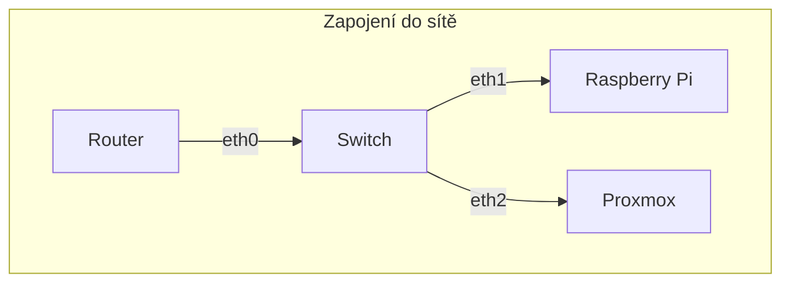

## Maturitní projekt
 Minipočítač Raspberry PI – využití v domácí počítačové sítí

 

 

## Obecné informace

- k našemu projektu jsme použili dvě raspberry-pi, jedno sloužící jako homelab server a druhý jako proxmox
- zde jsou výpisy operačních systémů, které jsme pužili:

    1. raspberry-pi (malina) raspbian
        - OS: Debian GNU/Linux 11 (bullseye) aarch64
        - Host: Raspberry Pi 4 Model B Rev 1.5
        - Kernel: 6.1.21-v8+
        - Packages: 1045 (dpkg)
        - Shell: bash 5.1.4
        - Terminal: /dev/pts/0 
        - CPU: BCM2835 (4) @ 1.800GHz
        - Memory: 2695MiB / 7762MiB
       
    2. raspberry-pi (proxmox) pimox
        - OS: Proxmox VE 7.2-7 aarch64
        - Host: Raspberry Pi 4 Model B Rev 1.5
        - Kernel: 6.1.21-v8+
        - Packages: 859 (dpkg)
        - Shell: bash 5.1.4
        - Terminal: /dev/pts/0
        - CPU: BCM2835 (4) @ 1.800GHz
        - Memory: 4242MiB / 7812MiB
    
 

## Služby

- zde jsou služby, které jsme použili:
    1. raspberry-pi (malina)
        - Docker
            - Apache
            - Bitwarden
            - Code server
            - File browser
            - Grafana
            - Homebridge
            - InfluxDB
            - MQTT
            - Node-RED
            - Photoprism
            - Pi.alert
            - Pihole
            - Plex
            - Portainer
            - Dashy
            - Twingate konektory
            - Vikunja
        - Cockpit
        - NAS - OMV
        - SSH
        - FTP
        - SMB
        - NFS
        - GPIO
            - kamera
    2. raspberry-pi (proxmox)
        - LXC Kontejnery
            - Zabbix
            - Minecraft server
        - Virutální počítače
            - Home-assistant

 

## Splněné prvky v <a href="./Zadání/zadani.md">zadání</a>
- Tadeáš Pastyřík
    - [x] NAS server
    - [x] Cloudfare tunel + doména
    - [x] Web server (apache)
    - [x] SSH, FTP, NFS, Samba
    - [x] Virtuální servery
    - [x] další nástroje pro správu domácího serveru
- Tomáš Pivnička
    - [x] webové rozhraní pro správu
    - [x] AI kamera s umělou inteligencí
    - [x] Minecraft , python	
    - [x] monitoring	
    - [x] streamovací platforma	
    - [x] další nástroje pro správu domácího serveru

 

## Zapojení do sítě

- k zapojení jsme použili switch a ethernet kabely (wifi nedoporučuejem používat)

## Dokumentace instalace

- jednotlivé instalace si projdeme ve složce <a href="./Dokumentace/">Dokumentace</a>
    - <a href="./Dokumentace/Dokumentace RaspberryPi.docx">word</a>
    - <a href="./Dokumentace/malina.md">malina</a>
    - <a href="./Dokumentace/kamera/kamera.md">kamera</a>
    - <a href="./Dokumentace/promox/proxmox.md">pimox</a>
        - <a href="./Dokumentace/promox/home assistant.md">home assistant</a>
        - <a href="./Dokumentace/promox/minecraft server.md">minecraft server</a>
        - <a href="./Dokumentace/promox/zabbix.md">zabbix</a>

 

## Otázky k prezentaci

| Otázka | Odpověď |
| ----------------------- | --------------------------------------- |      
| Jak dlouho nám zabral projekt?                                    | Přibližně 120 hodin (společně s dokumentací).                 |
| Jak se nám projekt povedlo rozplánovat? 	                        | Práci jsme si do dvojce rozdělili dobře a termíny jednotlivých sprintů jsme stíhali krásně.           |
| Kdybychom věděli do čeho jdeme, vzali bychom si toto téma znova? 	| Rozhodně ano.  |
| Jak jsem s naší práci spokojení? 	                                | Práci jsme se snažili udělat co nejvíce praktickou pro typické domácí užití a jsme s ní velice spokojení.  |

     